# Containerized Flask Application on AWS

## 1. Project Title and Objective

**Project:** Containerized Flask Application (Docker + Amazon ECR + Amazon ECS on Fargate)

**Objective:** Containerize a Python Flask application using Docker, store the image in Amazon ECR, and deploy it as a running container on Amazon ECS (Fargate). The project also demonstrates secure handling of configuration: non-sensitive values are passed as environment variables, and sensitive values are injected from AWS Secrets Manager at runtime.

---

## 2. AWS Services and Technologies Used

| Service / Tool | Purpose |
|---|---|
| Python Flask | Web application framework |
| Gunicorn | Production WSGI server inside the container |
| Docker | Containerizing the application |
| Amazon ECR | Private registry for the Docker image |
| Amazon ECS (Fargate) | Serverless container orchestration and hosting |
| AWS Secrets Manager | Secure storage of the `API_KEY` secret |
| AWS IAM | Task execution role and permissions |
| Amazon CloudWatch Logs | Container log collection |
| Amazon VPC / Security Group | Network access on port 5000 |

---

## 3. Architecture / Workflow

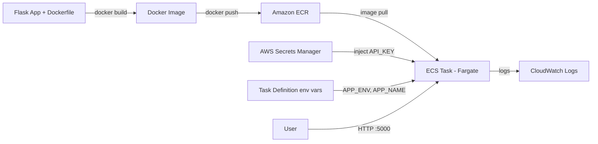

**Flow:**
1. The Flask app is packaged into a Docker image.
2. The image is pushed to a private ECR repository.
3. An ECS task definition references the ECR image, environment variables, and the Secrets Manager secret.
4. An ECS service runs the task on Fargate in a public subnet with a security group allowing port 5000.
5. The app is reached at `http://<PUBLIC_IP>:5000`.

---

## 4. Implementation Steps

### Step 1: Develop the Flask application
`app.py` exposes three endpoints:

| Route | Description |
|---|---|
| `/` | Greeting and current environment (from env vars) |
| `/health` | Health check |
| `/config` | Reports whether `API_KEY` is loaded (never returns the value) |

### Step 2: Create the Dockerfile
Based on `python:3.11-slim`, installs dependencies, runs as a non-root user, and starts the app with Gunicorn on port 5000. A `.dockerignore` keeps `venv`, `.env`, and caches out of the image.

### Step 3: Build the Docker image
```bash
docker build -t flask-ecs-app .
```

### Step 4: Test the container locally
```bash
docker run -d -p 5000:5000 -e APP_ENV=local -e APP_NAME=MyApp -e API_KEY=local-test-key --name flask-test flask-ecs-app
curl http://127.0.0.1:5000/
curl http://127.0.0.1:5000/health
curl http://127.0.0.1:5000/config
```

### Step 5: Create an Amazon ECR repository
```bash
aws ecr create-repository --repository-name flask-ecs-app --image-scanning-configuration scanOnPush=true --region ap-south-1
```

### Step 6: Push the image to ECR
```bash
aws ecr get-login-password --region ap-south-1 | docker login --username AWS --password-stdin <ACCOUNT_ID>.dkr.ecr.ap-south-1.amazonaws.com
docker tag flask-ecs-app:latest <ACCOUNT_ID>.dkr.ecr.ap-south-1.amazonaws.com/flask-ecs-app:latest
docker push <ACCOUNT_ID>.dkr.ecr.ap-south-1.amazonaws.com/flask-ecs-app:latest
```

### Step 7: Create the ECS cluster and task definition
- Stored the sensitive value in Secrets Manager (`flask/app-secrets`).
- Gave `ecsTaskExecutionRole` permission (`secretsmanager:GetSecretValue`) to read that secret.
- Created the cluster `flask-cluster` (Fargate).
- Created the task definition `flask-task` (0.25 vCPU / 0.5 GB, Linux/X86_64) with:
  - Environment variables: `APP_ENV=production`, `APP_NAME=FlaskECS`
  - Secret: `API_KEY` from Secrets Manager (`<secret-arn>:API_KEY::`)
  - CloudWatch logging enabled

### Step 8: Deploy using ECS
- Created security group `flask-sg` allowing inbound TCP 5000.
- Created service `flask-service` (Fargate, 1 task, default VPC, public subnet, public IP enabled).

### Step 9: Access and test the running application
```bash
curl http://<PUBLIC_IP>:5000/
curl http://<PUBLIC_IP>:5000/health
curl http://<PUBLIC_IP>:5000/config
```

Expected results:
- `/` returns `{"environment":"production","message":"Hello from FlaskECS"}`
- `/health` returns `{"status":"healthy"}`
- `/config` returns `{"api_key_set":true}`

---

## 5. Screenshots

### Local development
| Project files | Docker build |
|---|---|
| 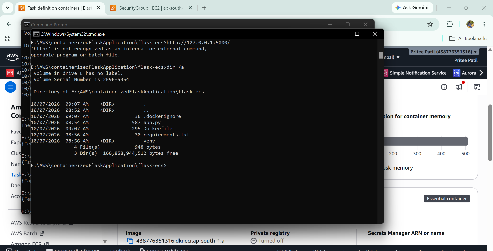 | 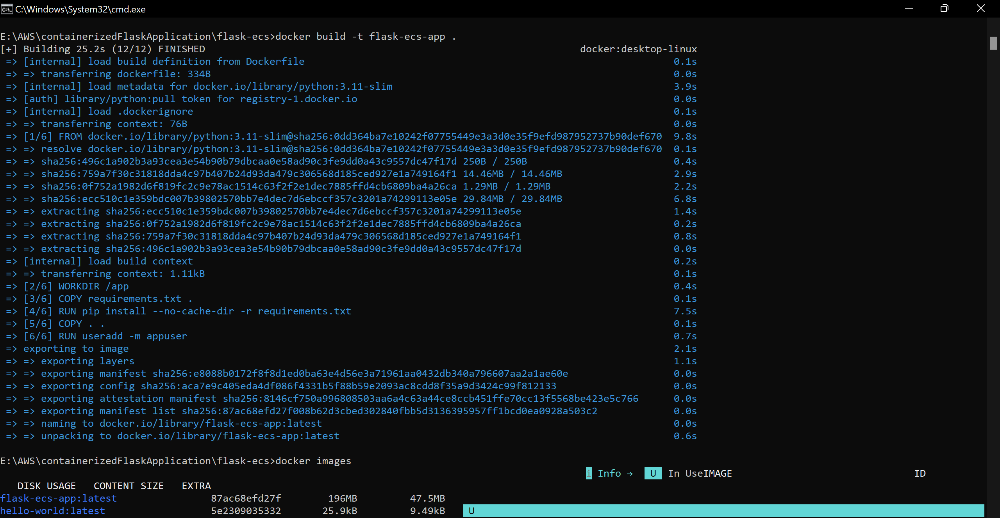 |

### Local container test
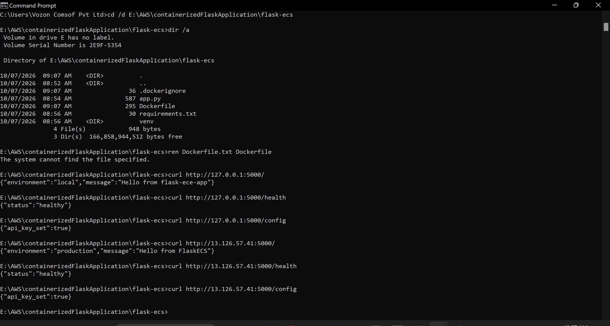

### Amazon ECR repository with pushed image
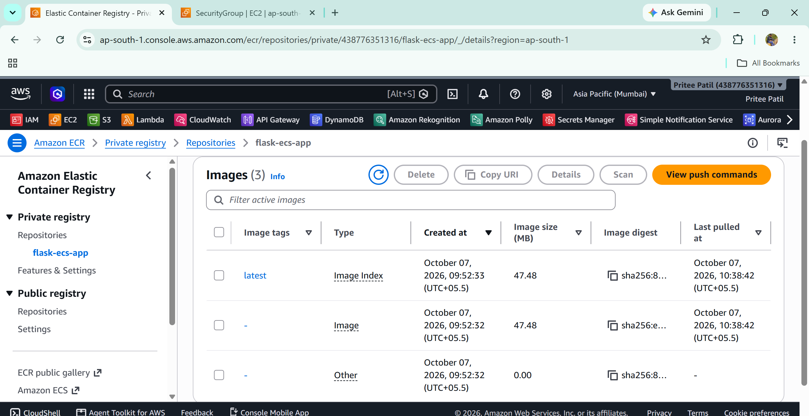

### AWS Secrets Manager (value hidden)
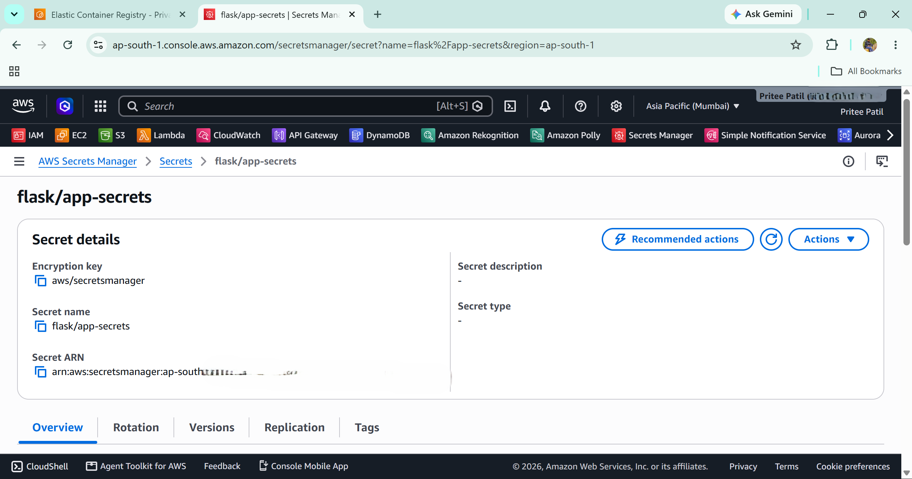

### IAM task execution role
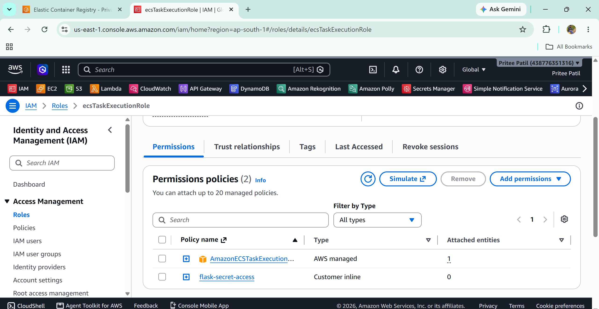

### ECS cluster
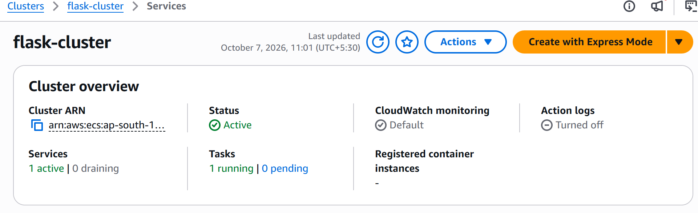

### Task definition (environment variables and secret)
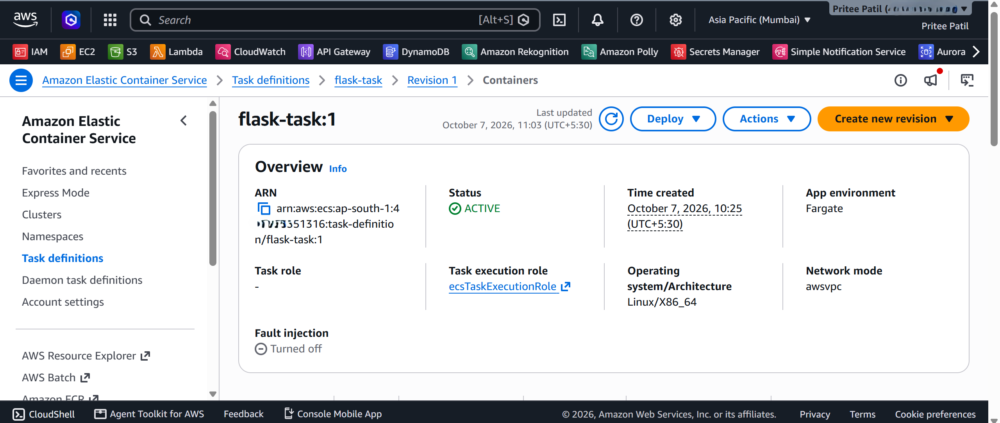

### Security group inbound rule
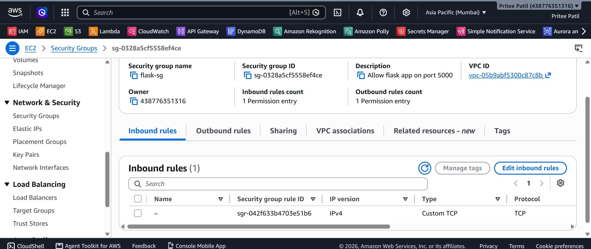

### ECS service with running task
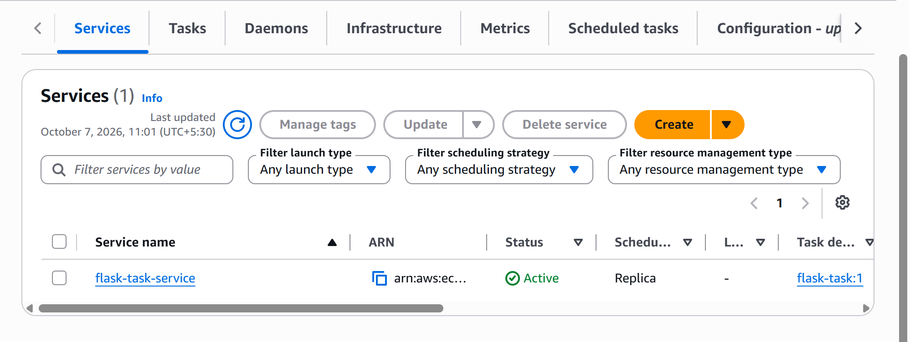

### Task details and logs
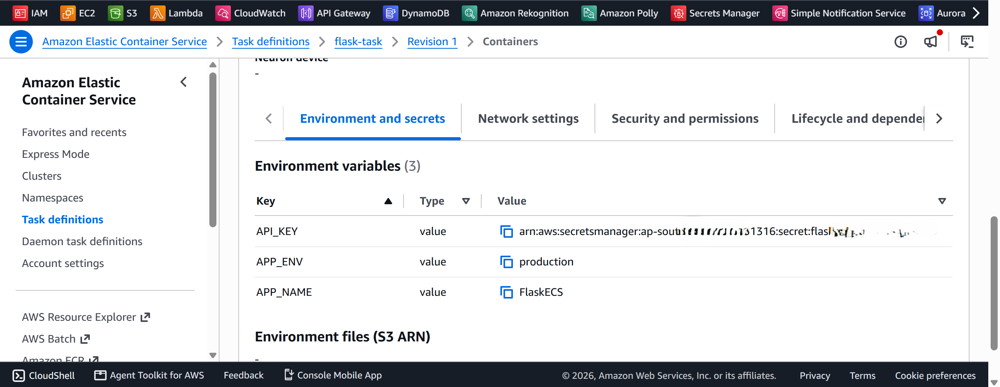


---

## 6. How to Run or Deploy the Project

### Prerequisites
- Python 3.10+
- Docker Desktop
- AWS CLI configured (`aws configure`) with an IAM user that has ECR, ECS, IAM, Secrets Manager, CloudWatch, and VPC permissions

### Run locally (without Docker)
```bash
pip install -r requirements.txt
python app.py
```
Open `http://127.0.0.1:5000/`.

### Run with Docker
```bash
docker build -t flask-ecs-app .
docker run -d -p 5000:5000 -e APP_ENV=local -e APP_NAME=MyApp -e API_KEY=test-key flask-ecs-app
```

### Deploy to AWS
1. Create an ECR repository and push the image (Steps 5 and 6 above).
2. Create the secret in Secrets Manager:
   ```bash
   aws secretsmanager create-secret --name flask/app-secrets --secret-string "{\"API_KEY\":\"<your-secret-value>\"}" --region ap-south-1
   ```
3. Ensure `ecsTaskExecutionRole` exists with `AmazonECSTaskExecutionRolePolicy` plus an inline policy allowing `secretsmanager:GetSecretValue` on the secret.
4. Create an ECS Fargate cluster and a task definition using the ECR image, port 5000, environment variables, and the secret.
5. Create a security group allowing TCP 5000, then create an ECS service with a public IP.
6. Open `http://<PUBLIC_IP>:5000/`.

### Clean up (to avoid charges)
Delete the ECS service, cluster, ECR repository, secret, security group, and CloudWatch log group when finished.

---

## 7. Key Learnings

- **Containerization:** A Dockerfile makes the app portable and identical across local and cloud environments. Running as a non-root user and using `.dockerignore` are good security habits.
- **Image registry workflow:** Authenticate Docker to ECR, tag the image with the repository URI, then push.
- **ECS Fargate:** Fargate removes server management. Task definitions describe the container, and services keep the desired number of tasks running.
- **Secure configuration:** Non-sensitive config belongs in environment variables. Sensitive values belong in Secrets Manager and are injected at runtime, so they never appear in the code, the image, or the repository.
- **IAM matters:** The task execution role needs permission to pull from ECR, write logs, and read the secret. The first ECR command failed with `AccessDeniedException` until the IAM user was given the right permissions.
- **Service-linked role and failed stacks:** The ECS cluster creation initially failed with a service-linked role error. The role already existed, and the cause was a leftover failed CloudFormation attempt, which had to be cleaned up before retrying.
- **Networking:** Fargate tasks in a public subnet need a public IP to pull the image, and the security group must allow the application port.
- **Troubleshooting:** The task's stopped reason and the CloudWatch logs are the first places to look when a task fails.
- **Cost hygiene:** Deleting the service, cluster, secret, and repository after testing avoids ongoing charges.

---

## Repository Structure

```
.
├── app.py
├── requirements.txt
├── Dockerfile
├── .dockerignore
├── .gitignore
├── README.md
└── screenshots/
```